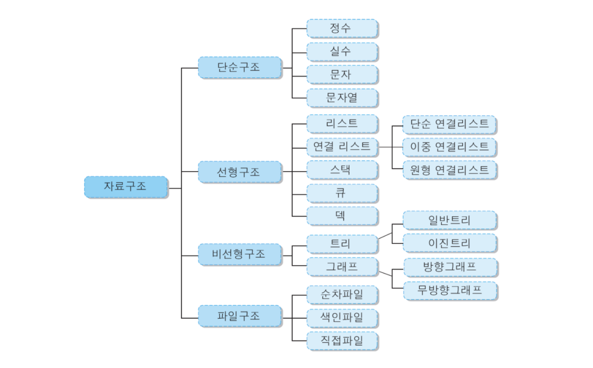
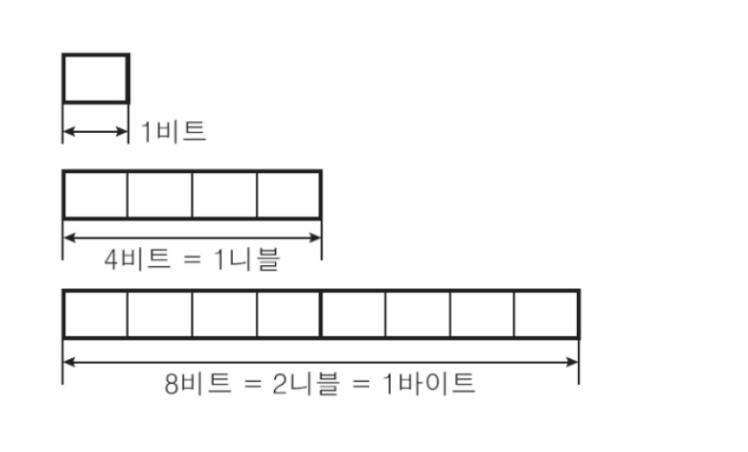
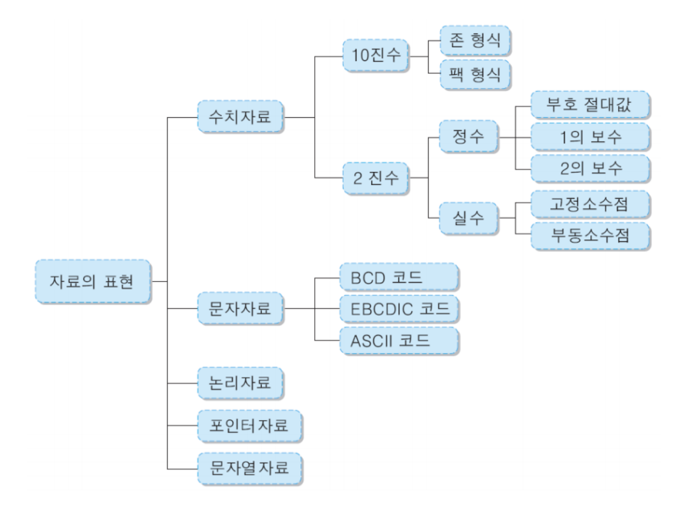

# 자료구조

- 자료를 효율적으로 사용하기 위해서 자료의 특성에 따라서 분류하여 구성하고 저장 및 처리하는 모든 작업
  - 데이터형: 시스템 제공 데이터 형과 사용자 정의 데이터 형 존재
    - 시스템 제공 데이터 형: int, char, float, double, boolean 등
    - 사용자 정의 데이터 형: 시스템 제공 데이터 형을 결합하여 새로운 데이터 형을 만듦
  - 리스트, 스택, 트리, 그래프 등이 사용자 정의 자료구조의 대표적 방법론임

  

# 디지털 자료 표현

### 디지털 시스템에서의 자료의 표현

- 숫자, 문자, 그림, 소리, 기호 등 모든 형식의 자료를 2진수 코드로 표현하여 저장 및 처리
- 2진수 코드
  - 1과 0, ON과 OFF, 참과 거짓의 조합
- 2진수 코드의 단위

  

- n개의 비트로 2ⁿ개의 상태수 표현

### 컴퓨터 내부에서 표현할 수 있는 자료의 종류

  

### 2진수의 정수 표현

- n비트의 부호 절대값 형식
  - 최상위 1비트 : 부호 표시
    - 양수 (+) : 0
    - 음수 (-) : 1
  - 나머지 n-1비트 : 이진수 표시

### 2의 보수 (2's Complement) 형식

| 2진수 | 십진수 | 2진수 | 십진수 |
| ----- | ------ | ----- | ------ |
| 0000  | +0     | 1000  | -8     |
| 0001  | +1     | 1001  | -7     |
| 0010  | +2     | 1010  | -6     |
| 0011  | +3     | 1011  | -5     |
| 0100  | +4     | 1100  | -4     |
| 0101  | +5     | 1101  | -3     |
| 0110  | +6     | 1110  | -2     |
| 0111  | +7     | 1111  | -1     |

1. 0010 + 0011 = 0101 (5)
2. -2 → 1110
   -3 → 1101
   1110 + 1101 = 1011 (2의 보수로 -5)
3. 3 → 0011
   -2 → 1110
   0011 + 1110 = 0001 (1)
4. 2 → 0010
   -3 → 1101
   0010 + 1101 = 1111 (2의 보수로 -1)

> **왜 2의 보수를 쓰는가?**
>
> - 덧셈 회로만으로 뺄셈도 처리 가능함
> - 음수를 따로 처리할 필요 없이 그냥 더하기로 해결 가능하니까, 하드웨어가 간단해짐

### 2진수의 실수 표현

- 고정 소수점 표현
  - 정수부와 소수부로 표현함
  - 12.34는 정수부에 12, 소수부에 34를 기억
  - 32비트라면 부호비트를 제외한 31비트에 정수부와 소수부를 나누어 저장
- 부동 소수점 형식의 표현
  - 고정 소수점 형식에 비해서 표현 가능한 값의 범위가 넓음
  - 실수를 부호와 지수, 소수의 세 부분으로 구분하여 표현
